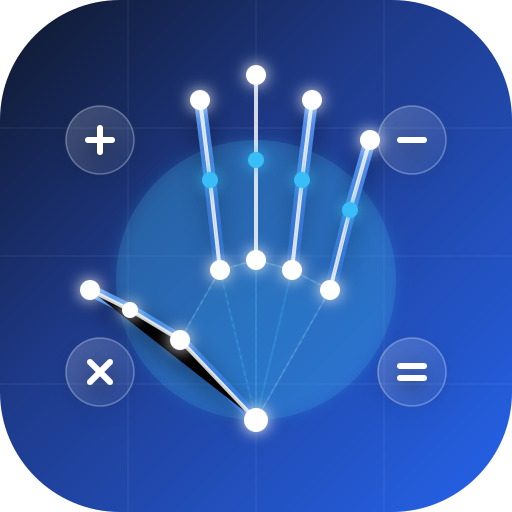
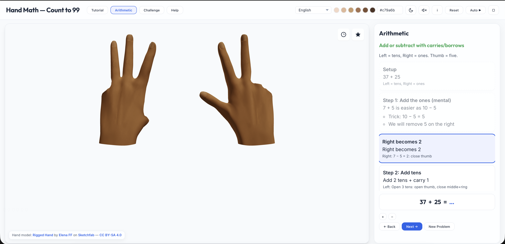

<div align="center">



# 3D Hand Math — Count to 99

An interactive 3D hand visualization app that teaches counting and arithmetic (0–99) using finger patterns on two hands. Built with Three.js.

<p>
  <a href="https://github.com/bizzkoot/Hand-Math/releases/latest"></a>
  <a href="https://github.com/bizzkoot/Hand-Math/releases/latest"></a>
  <a href="https://github.com/bizzkoot/Hand-Math/releases"></a>
</p>

**Left hand = tens** (0, 10, 20, ... 90) &nbsp;|&nbsp; **Right hand = ones** (0–9)  
Each digit follows a specific finger sequence where **thumb = 5** and other fingers = 1 each.

<br>


</div>


## Features

### 🧮 Educational Modes
- **Tutorial** — Step-by-step decomposition of a number into tens and ones
- **Arithmetic** — Addition and subtraction with animated carry/borrow pedagogy, practice levels (1–3), and filter (add/sub/both). Auto-play mode with SpeechSynthesis (TTS) narration at 0.1×–3.0× speed (adjustable in 0.1× intervals).
- **Challenge** — Timed quiz (15 s per question) across 3 tiers (Level 1–3) stored in local storage. Features a progression unlock system (Tier 1 requires 15 gems, Tier 2 requires 30 gems) and rating decays (Gold, Silver, Bronze) based on elapsed time, incorrect submissions, and hint usage. Displays a multiple-choice selection grid for Level 6 (Mental Arithmetic) instead of manual hand inputs.
- **Operand Level Selection** — Choose maximum range for numbers or mental mode (Level 1–6, spanning 1–20 to 1–99, with Level 6 introducing multi-step mental arithmetic equations) via a top-centered badge overlay in the 3D scene to adjust difficulty across Tutorial, Arithmetic, and Challenge modes.
- **Help** — Static guide + 3-step guided tour overlay

### 🖐️ Hand & Interaction
- Bone-anchored finger articulation via quaternion slerp (primary) with Euler fallback
- Finger counting from 0 to 9 on each hand using a defined finger sequence (thumb = 5, fingers = 1)
- Skin tone picker (6 presets + custom hex input, shortcuts disabled while hex input is focused)
- 3D scene with orbit camera (drag to rotate, scroll to zoom) and toolbar overlays to:
  - **Reset Camera** — Snap back to the calibrated starting view position.
  - **Toggle Wireframe** — View underlying skeletal rendering on GLTF/GLB hand models.

### 🎨 UI & Accessibility
- Full i18n: English and Bahasa Melayu (240+ translation keys each)
- Dark/light theme toggle (persisted to localStorage)
- **Screen Wake Lock** — Prevents screens from sleeping during active lessons. Uses native wake locks with a looping silent video fallback on iOS/Safari.
- **Web Audio SoundSynth** — Synthetic sound cues (click, chime, buzzer) generated programmatically via the Web Audio API without loading external audio files.
- Fullscreen mode
- Keyboard shortcuts: Enter/Space (next), A (auto), R (reset), ? (help), Escape (close modals). In Guided Tour mode, use ArrowRight (next) and ArrowLeft (back).
- Responsive layout with **Header Auto-Fitting** (applies data-compact 0–3 to dynamically adjust margins/padding) ensuring no-scroll layout for 1280×800+.

## 🚀 Quick Start

### Option 1: Node.js (Recommended)

```bash
npm install
npm start
# Opens at http://localhost:8080
```

### Option 2: Python

```bash
npm run serve
# Python 3 http.server on port 8080
```

The app must be served over HTTP (not `file://`) due to CORS restrictions on GLTF model loading.

## 📱 Progressive Web App (PWA)

This application is PWA-enabled, allowing you to install it directly onto your desktop or mobile device for standalone, offline access:

* **Desktop (Chrome / Edge)**: Click the **Install** icon on the right side of the address bar.
* **iOS (Safari)**: Tap the **Share** button and select **Add to Home Screen**.
* **Android (Chrome)**: Tap the three-dot menu and select **Install App**.
* **Offline Access & Cache**: Assets, scripts, stylesheets, and 3D GLTF models are cached locally. The app checks for newer updates automatically every 30 minutes and prompts a reload banner when updates are ready.

<details>
<summary><h2 style="display:inline">🤖 Android APK (Capacitor)</h2></summary>

For devices that cannot install PWAs (e.g. kids tablets with locked-down browsers), the app ships as a native Android APK wrapped with [Capacitor](https://capacitorjs.com). The web app and PWA remain unchanged — the APK serves the same static files from local assets.

> **[📦 Download Latest APK](https://github.com/bizzkoot/Hand-Math/releases/latest)** *(~12 MB, Android 5.1+)*

### Prerequisites

* **JDK 21** — Capacitor 8's Android toolchain requires it: `brew install openjdk@21`
* **Android SDK** — Command-line tools or Android Studio: `sdkmanager "platforms;android-36" "build-tools;36.0.0"`
* `ANDROID_HOME` pointing to the SDK (e.g. `~/Library/Android/sdk`)

### Build & Install

```bash
npm run android:apk              # stage www/, sync, build debug APK
adb install -r android/app/build/outputs/apk/debug/app-debug.apk
```

The debug APK lands at `android/app/build/outputs/apk/debug/app-debug.apk` (~13 MB).

Other commands:

```bash
npm run cap:prepare              # stage the web app into www/ only
npm run cap:sync                 # stage + copy www/ into the Android project
npm run android:apk-release      # build signed release APK (via keystore.properties)
node scripts/generate-android-icons.js   # regenerate launcher icons + splashes
```

### App Identity & Versioning

* Package ID: `com.handmath.app`, App Name: `Hand Math` (configured in `capacitor.config.json`).
* **Version bumps**: update `version` in `package.json`, `versionCode` / `versionName` in `android/app/build.gradle`, and `HANDMATH_VERSION` in `js/appVersion.js`. `versionCode` must increase monotonically for update installs.

### In-App Update Checker (GitHub Releases)

The app self-checks for newer releases (modeled on the native update flow of `bizzkoot/lnreader`):

* On startup (~3s after load) and on app resume, `js/updateChecker.js` compares the latest release tag against the packaged `HANDMATH_VERSION` (`js/appVersion.js`). Auto-checks are **throttled** (GitHub's unauthenticated API allows only 60 requests/hour per IP): at most one network attempt every 30 minutes and one successful refresh every 3 hours.
* Primary source is `https://api.github.com/repos/bizzkoot/Hand-Math/releases/latest` (same as `bizzkoot/lnreader`). Offline and timeout failures stay silent on auto-check and show an error on manual check; failures never count as a successful check, so the next auto-check retries instead of waiting out the 3-hour success window.
* Rate-limit only (API 403/429): falls back to the tag-only `latest.json` in the repo (served by `raw.githubusercontent.com`, not API-rate-limited) so the user still sees installed-vs-latest versions with a "GitHub is limiting… retry later" notice. Other errors never touch the tag file, so a broken API response can't silently degrade into a tag-only alert.
* When a newer tag exists, a modal alerts the user with the release notes and a **Download update** button that opens the release APK (`*.apk` asset) in the system browser, where Android handles the download and install prompt.
* "Skip this version" remembers the dismissed release (`localStorage['hm-update-skip']`) so the auto-alert stays quiet for it; a manual **Check for updates** button in the Changelog modal always overrides the skip and reports "up to date" too.
* Network failures are silent for automatic checks; manual checks show a retry dialog (with a specific message when the API is rate-limited).
* Version comparison is numeric per segment (e.g. `v1.0.10 > v1.0.9`), tolerant of a missing `v` prefix.

**Release procedure (per release)**: bump the three version sources → build & sign the APK → `gh release create vX.Y.Z HandMath-vX.Y.Z.apk --latest` → update `latest.json` with the new tag and push (safe ordering: publish the release first, `latest.json` second — a stale `latest.json` can only under-report, never point users at a missing APK).

### Release Signing

Release builds automatically sign via `android/keystore.properties` (git-ignored):

```properties
storeFile=handmath-release.keystore
storePassword=yourPassword
keyAlias=handmath
keyPassword=yourPassword
```

Run `npm run android:apk-release` to generate the signed APK at `android/app/build/outputs/apk/release/app-release.apk`. For a Google Play bundle, run `cd android && ./gradlew bundleRelease`.

### Native-specific Behaviour

Inside the APK WebView:
* Service Worker registration is skipped (assets are local; nothing to cache) — `js/main.js`.
* The PWA "Install Hand Math" widget is suppressed (the app is already installed natively) — `js/uiBindings.js`.
* All teaching, arithmetic, challenge, and 3D features function identically to the web app.

</details>

<details>
<summary><h2 style="display:inline">📁 Project Structure</h2></summary>

```
Hand_Math/
├── index.html               # Main app entry point (334 lines)
├── teaching.html            # Standalone teaching UI (no skin/i18n)
├── package.json
├── capacitor.config.json    # Capacitor wrapper config (appId, webDir)
├── scripts/
│   ├── generateChangelog.js # Generates js/changelog.js from git history
│   ├── prepare-www.js       # Stages the web app into www/ for Capacitor
│   └── generate-android-icons.js # Renders launcher icons + splashes from icon.svg
├── styles/
│   ├── main.css             # Core layout, theme, controls, responsive
│   └── teaching.css         # Teaching panels, tabs, tour overlay, halos, cues
├── js/
│   ├── main.js              # HandMathApp — scene setup, GLTF loading, UI wiring
│   ├── handController.js    # HandController — finger articulation (slerp + Euler)
│   ├── handMathCalculator.js# Digit patterns, total calculation, validation
│   ├── handBoneMap.js       # Maps GLTF bone names to { base, middle, tip }
│   ├── handAdapter.js       # Bridges HandController to StepEngine for teaching
│   ├── stepEngine.js        # Executes teaching step sequences
│   ├── arithmeticBuilder.js # Builds step sequences for add/sub with narration
│   ├── teachingOrchestrator.js # Manages mode switching, step state, nav
│   ├── uiBindings.js        # All UI event wiring, SoundSynth, challenge, auto-play
│   ├── mentalArithmeticGenerator.js # Generates multi-step mental arithmetic equations & choices
│   ├── skinToneService.js   # Material caching and color application
│   ├── i18n.js              # I18n class with en/ms locale data
│   ├── testApi.js           # TEST_API for Playwright automation
│   ├── handDebug.js         # Console debug helpers (curl, splay, pose, etc.)
│   ├── realisticHandGeometry.js # Procedural hand fallback (1071 lines)
│   ├── canvasHandRenderer.js    # 2D canvas renderer (alternative)
│   └── spriteHandController.js  # CSS sprite controller (legacy)
├── locales/
│   ├── en.json              # English translations
│   └── ms.json              # Malay translations
├── assets/
│   ├── models/              # Hand GLTF/GLB model files, textures, scene.bin
│   ├── license.txt          # CC BY-SA 4.0 license (hand model)
│   ├── rigged_hand.glb      # Original Sketchfab download
│   └── *.zip                # Original source archives
├── vendor/threejs/          # Three.js, OrbitControls, GLTFLoader (MIT)
├── android/                 # Capacitor Android project (committed; builds via Gradle)
├── www/                     # Staged web assets for the APK (git-ignored, generated)
├── specs/                   # EARS-format requirements, design docs, ADRs
├── tests/                   # 17 Playwright spec files
└── test-results/            # Screenshots and diagnostics
```

</details>

<details>
<summary><h2 style="display:inline">🧠 How It Works</h2></summary>

### Finger Counting Pattern

Each hand uses a specific finger sequence (not binary counting). The thumb represents 5, while each other finger represents 1:

| Value | Thumb | Index | Middle | Ring | Pinky |
| :---: | :---: | :---: | :---:  | :---:| :---: |
|   0   |   ✗   |   ✗   |   ✗    |  ✗   |   ✗   |
|   1   |   ✗   |   ✓   |   ✗    |  ✗   |   ✗   |
|   2   |   ✗   |   ✓   |   ✓    |  ✗   |   ✗   |
|   3   |   ✗   |   ✓   |   ✓    |  ✓   |   ✗   |
|   4   |   ✗   |   ✓   |   ✓    |  ✓   |   ✓   |
|   5   |   ✓   |   ✗   |   ✗    |  ✗   |   ✗   |
|   6   |   ✓   |   ✓   |   ✗    |  ✗   |   ✗   |
|   7   |   ✓   |   ✓   |   ✓    |  ✗   |   ✗   |
|   8   |   ✓   |   ✓   |   ✓    |  ✓   |   ✗   |
|   9   |   ✓   |   ✓   |   ✓    |  ✓   |   ✓   |

The total value is `(left hand pattern value × 10) + right hand pattern value`, giving a range of 0–99.

### Hand Math System

- **Left hand**: shows a pattern 0–9, interpreted as tens (0, 10, 20, ... 90)
- **Right hand**: shows a pattern 0–9, interpreted as ones (0, 1, 2, ... 9)
- Example: left hand = pattern 3 (index+middle+ring), right hand = pattern 7 (thumb+index+middle) → total = 30 + 7 = 37

### Teaching Pedagogy

- **Addition with mental carry**: ones are added first; if the sum exceeds 9, the complement relative to 10 is shown with a carry to tens
- **Subtraction with borrow**: if ones of A < ones of B, 10 is borrowed from the tens place, then ones are subtracted; remaining tens are then subtracted
- Visual cues (`+ 10 ↷` / `− 10 ↶`) animate on screen during carry/borrow steps

</details>

## 📜 Model Credits

This app uses the **"Rigged Hand"** 3D model by **Elena FF**, available on Sketchfab and licensed under **CC BY-SA 4.0**.

- Model: [Rigged Hand on Sketchfab](https://sketchfab.com/3d-models/rigged-hand-eae97cc2a742413cb5338ab942b12c1e)
- Author: [Elena FF](https://sketchfab.com/elenaferfor)
- License: [CC BY-SA 4.0](https://creativecommons.org/licenses/by-sa/4.0/)

The full license text is included at `assets/license.txt`. The credit also appears as a live overlay in the app UI.

## 🛠️ Technical Stack

- **Three.js** (r158+) — WebGL 3D rendering, OrbitControls, GLTFLoader
- **Vanilla JavaScript** (ES6+) — no framework
- **CSS3** — CSS Grid, Flexbox, custom properties for theming, glassmorphism panels
- **HTML5** — semantic markup, ARIA roles, i18n attributes

### Browser Support
Chrome 60+, Firefox 55+, Safari 12+, Edge 79+ (WebGL required)

<details>
<summary><h2 style="display:inline">🔧 Development</h2></summary>

### Skin Tone API

```js
handMathApp.setSkinColor('#c79a6b');
```

### Settings Persistence

All user settings are saved to `localStorage` (via `js/settingsStore.js`) and restored on the next app open: theme (`hm-theme`), language (`hm_lang`), sound mute (`hm-sound-muted`), skin tone (`hm-skin-hex`), narration speed (`hm-speed`), explicit narration on/off (`hm-tts-enabled`), screen wake (`hm-screen-wake`), operand level (`hm_operand_level`), and challenge progress. Regressive coverage lives in `tests/ui-settings-persistence.spec.js`.

Valid hex formats: `#RGB` or `#RRGGBB`. Invalid values return `false`.

### Debugging

Set log level before app init:

```js
window.HANDMATH_LOG_LEVEL = 'debug'; // 'info' | 'debug' (default: 'warn')
```

Console helpers:

```js
handMathApp.handController.captureClosedPoseForHand('left'|'right');
handMathApp.demoCountingSequence();
```

A debug finger-animation panel exists but is not shipped by default; see `AGENTS.md` for wiring instructions.

### Tests

```bash
# Run all Playwright tests (headless)
npx playwright test

# Single spec
npx playwright test tests/ui-arithmetic-add.spec.js

# With browser visible
npx playwright test --headed

# Without a server (local file mode)
HM_LOCAL_FILE=1 npx playwright test
```

### Adding Real Hand Models

The app loads GLTF/GLB models from `assets/models/`. To replace them, place new models in that directory and update the paths in `main.js:loadGLTFHandModels()`.

</details>

<details>
<summary><h2 style="display:inline">🗺️ Planned Features</h2></summary>

- [ ] Realistic hand textures and nail details
- [ ] Sound effects for finger movements
- [ ] Hand gesture recognition via webcam
- [ ] Export/import hand positions
- [ ] Virtual reality (VR) support
- [ ] Number pad entry
- [ ] Quick calculator UI

</details>

## ⚖️ License

The project code is licensed under the MIT License (see `package.json`). The 3D hand model "Rigged Hand" by Elena FF is used under CC BY-SA 4.0 (see `assets/license.txt`).
